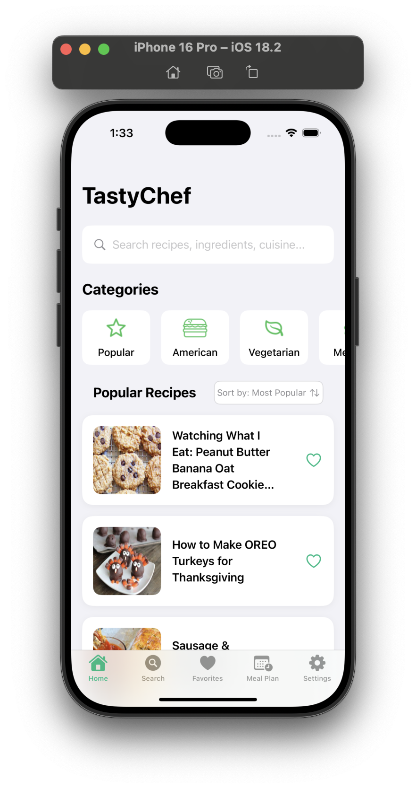
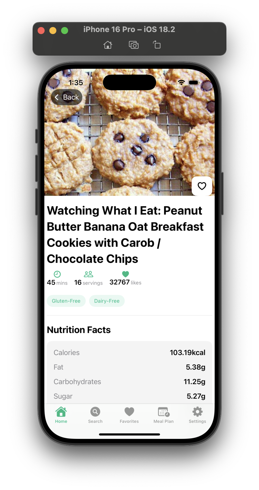
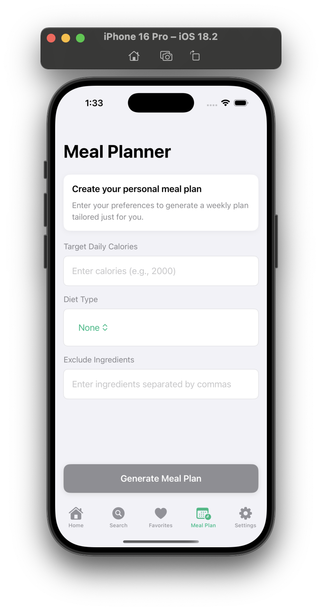
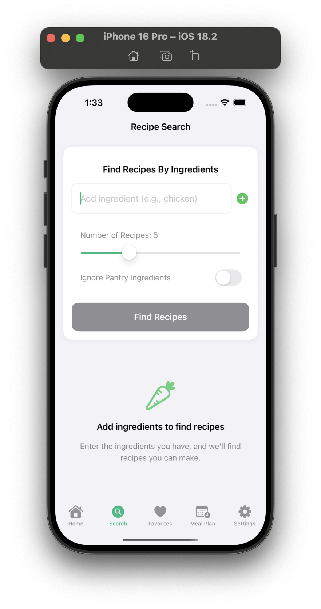

# TastyChef

<p align="center">
  
</p>

TastyChef is an iOS recipe and meal planning application that helps users discover recipes, plan meals, search by ingredients, and manage their cooking preferences.

## Features

### Recipe Discovery
- **Browse Popular Recipes**: Discover trending recipes
- **Filter by Category**: Browse recipes by cuisine type (American, Vegetarian, Mexican, Asian, etc.)
- **Search Functionality**: Find specific recipes by keyword
- **Sort Options**: Sort recipes by popularity, healthiness, price, or cooking time

### Ingredient-Based Search
- **Search by Ingredients**: Find recipes based on ingredients you have
- **Exclude Ingredients**: Filter out recipes with specific ingredients
- **Ingredient Match Percentage**: See how well your available ingredients match recipes

### Meal Planning
- **Weekly Meal Plans**: Generate personalized meal plans
- **Diet Type Selection**: Choose from various diet types (Vegetarian, Vegan, Gluten Free, etc.)
- **Calorie Targeting**: Set daily calorie targets for meal plans
- **Nutritional Information**: View detailed nutritional values for each day

### Recipe Details
- **Step-by-Step Instructions**: Clear cooking directions
- **Ingredient Lists**: Complete ingredient lists with amounts
- **Cooking Time**: Preparation and cooking duration
- **Servings**: Adjust for different numbers of diners
- **Nutritional Facts**: Detailed nutritional information

### User Accounts
- **User Profiles**: Personalized user profiles
- **Favorites**: Save and organize favorite recipes
- **Persistent Login**: Stay logged in across app launches

## Technical Implementation

TastyChef is built with:

- **SwiftUI**: Modern declarative UI framework
- **MVVM Architecture**: Clean separation of concerns
- **Firebase Authentication**: Secure user authentication
- **Firebase Storage**: Profile image storage
- **RESTful API Integration**: Recipe and meal plan data

## Installation

1. Clone the repository
   ```
   git clone https://github.com/yourusername/TastyChef.git
   ```

2. Open TastyChef.xcodeproj in Xcode

3. Install dependencies using Swift Package Manager (automatic in Xcode)

4. Configure Firebase:
   - Create a Firebase project at [firebase.google.com](https://firebase.google.com)
   - Add your iOS app to the Firebase project
   - Download `GoogleService-Info.plist` and add it to your project
   - Enable Authentication (Email/Password) in the Firebase console

5. Add your Spoonacular API key in `Secrets.plist`

6. Build and run the app

## Usage

### Finding Recipes
1. Browse popular recipes on the Home screen
2. Use the search bar to find specific recipes
3. Tap on category icons to filter by cuisine type
4. Use the sort button to change sorting order

### Ingredient-Based Search
1. Navigate to the Search tab
2. Add ingredients you have available
3. Set filters and preferences
4. View recipes that match your ingredients

### Meal Planning
1. Go to the Meal Plan tab
2. Enter your calorie target
3. Select diet preferences
4. Add ingredients to exclude (optional)
5. Generate your personalized meal plan

### Managing Your Account
1. Create an account or log in
2. Update your profile name
3. View and manage your favorite recipes

## Screenshots

<p align="center">
  
  
  
  
</p>

## Technologies Used

- **Swift 5.5+**
- **SwiftUI**
- **Combine Framework**
- **Firebase Authentication**
- **Firebase Storage**
- **SDWebImage** for image loading and caching
- **Spoonacular API** for recipe data

## Future Enhancements

- Shopping list generation
- Social sharing features
- Custom recipe creation
- Barcode scanning for ingredients
- Voice-guided cooking instructions
- Offline recipe storage

## License

TastyChef is licensed under the MIT License. See the LICENSE file for details.

## Credits

- Recipe data provided by [Spoonacular API](https://spoonacular.com/food-api)
- Icons from [SF Symbols](https://developer.apple.com/sf-symbols/) 
